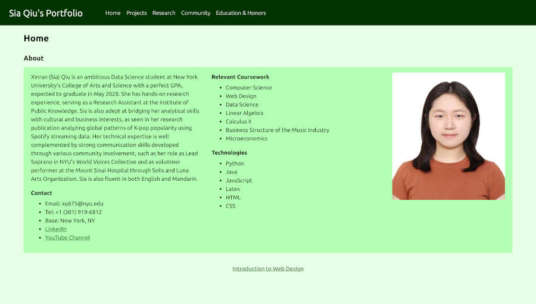

# Sia Qiu's Portoflio

This professionally-oriented website functions as a comprehensive, dynamic expanded resume and data science portfolio aimed at future employers and academic program admissions. The site, consisting of five core pages, is designed to synthesize Sia's academic skills, extensive research experience, practical web development abilities, and community involvement.

## Live Demo
https://xq675.github.io/portfolio/

## Technologies
- HTML
- CSS
- JavaScript

## Key Features
- Responsive Layout Using Media Queries: each page has a navigation bar at the top of the viewport, an expandable menu icon for mobile viewports, and two color palettes, applied using CSS flexbox and media queries
- CSS Grid Layout: multiple sections of content are available on each page, where each section is complemented by a responsive image and link, styled with CSS grid
- JavaScript Interactivity: JavaScript functions are called in response to user actions, such as toggling the menu icon to show navigation bar and hovering over sections to change background color

